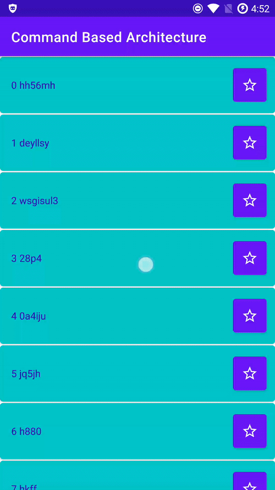

Android Command Based Architecture for processing concurent tasks (commands) on single or multiply data
======================

## Features

This library allows to execute different tasks on different threads and sync them between each other.

Key features in flow control:
1. Ability to controll if task should ever be executed or skipped based on current data (screen) state.
2. Ability to controll if task should be executed right now or later based on current data (screen) state.
3. Ability to block other tasks from execution (postope them) during task execution.

Key features in data change:
Each task has its own lifecycle:
1. After command was added to the queue - `onCommandWasAdded`
2. Right before command execution - `onExecuteStarting`
3. Right after succesful execution - `onExecuteSuccess`
4. Right after failed execution - `onExecuteFail`
5. Final step of execution (called on any success or fail) - `onExecuteFinished`

## Integration with Gradle

For coroutine implementation:
```
    implementation 'io.scal:commandbasedarchitecture_coroutine:version'
```

Please replace `version` with the latest version: [](https://bintray.com/mig35/android-maven/command-based-architecture-coroutine/_latestVersion)


For RxJava implementation:
```
    implementation 'io.scal:commandbasedarchitecture_rxjava:version'
```

Please replace `version` with the latest version: [](https://bintray.com/mig35/android-maven/command-based-architecture-rxjava/_latestVersion)


## How to use

Please find full description in [Medium post TODO](https://medium.com).

Usual realization requires this steps:
1. Create an instance of CommandManager: `val commandManager: CommandManager<ScreenState> by lazy { CommandManagerImpl(mutableScreenState, viewModelScope) }`
2. Create your command or use an existing command (RefreshCommand, LoadNextCommand).
    a. Implement execution strategy directly in command or use existing or yours (ExecutionStrategy class)
    b. Implemet data side effects during command lifecycle
3. Add command to execution queue by calling `commandManager.postCommand(yourCommand)`

By default CommandManager use `Dispatchers.Main` for execution so you will have to switch to appropriate Diapatcher if you do something hard in this command.


## Customizations

You can enable and disable circular loop using two arguments constructor. Pass true to enable loop and false to disable.

You can make carousel Vertically and Horizontally by changing first argument.


## Example



#### Contact ####

Feel free to get in touch.

    Website:    http://scal.io
    LinkedIn:   https://www.linkedin.com/company/scalio/
    LinkedIn:   https://www.linkedin.com/in/mig35/
    Email:      mikhail@scal.io
    Email:      mig35@mig35.com

#### License ####

    Licensed under the Apache License, Version 2.0 (the "License");
    you may not use this file except in compliance with the License.
    You may obtain a copy of the License at

       http://www.apache.org/licenses/LICENSE-2.0

    Unless required by applicable law or agreed to in writing, software
    distributed under the License is distributed on an "AS IS" BASIS,
    WITHOUT WARRANTIES OR CONDITIONS OF ANY KIND, either express or implied.
    See the License for the specific language governing permissions and
    limitations under the License.